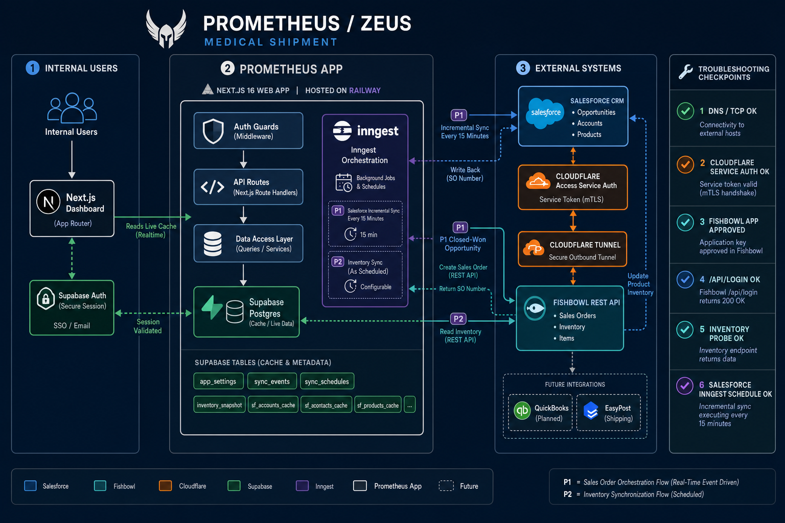

# Prometheus Context

Last updated: 2026-05-05

Prometheus, also called Zeus in client conversations, is Medical Shipment's internal integration and operations app. It joins Salesforce, Fishbowl, and later QuickBooks/EasyPost data into a Supabase-backed web dashboard and automation layer.

## Purpose

Prometheus is designed to:

- Cache Salesforce CRM data for fast internal reporting.
- Sync closed-won Salesforce opportunities into Fishbowl sales orders.
- Sync Fishbowl inventory into Supabase and back to Salesforce products.
- Provide internal dashboards for orders, inventory, sync health, events, reps, and integration status.
- Give operators a single place to trigger and inspect sync jobs.

## Main Systems

| System | Role | Access path |
| --- | --- | --- |
| Next.js app | Web UI, API routes, auth guards, dashboard data access | Railway deployment and local dev |
| Supabase Postgres | Live cache tables, settings, sync events, schedules | Service role from server code only |
| Inngest | Scheduled and event-driven orchestration | `/api/inngest` served by the app |
| Salesforce | Source of CRM accounts, users, products, opportunities, profile calls | OAuth/password connection via `jsforce` |
| Fishbowl REST API | Inventory source and sales order target | Cloudflare Access service token -> tunnel -> Fishbowl REST |
| Cloudflare Access/Tunnel | Secure private Fishbowl exposure to Railway | `fishbowl.medshipment.com` |
| QuickBooks | Future invoice/payment sync target/source | Phase 3 |
| EasyPost | Future shipment tracking source | Phase 4 |

## Application Layers

### Frontend

The dashboard lives under `src/app/dashboard`. Server-side dashboard access is enforced in:

- `src/app/dashboard/layout.tsx`
- `src/lib/auth.ts`

Public pages and login are outside `/dashboard`.

### API Routes

Important routes:

- `GET /api/health`: public liveness only. It intentionally does not check external systems or expose errors.
- `GET /api/health/fishbowl`: authenticated Fishbowl diagnostic.
- `GET /api/health/salesforce`: authenticated Salesforce diagnostic.
- `GET /api/health/quickbooks`: authenticated QuickBooks diagnostic.
- `POST /api/sync/trigger`: authenticated/admin manual automation trigger.
- `POST /api/sync/salesforce`: authenticated/admin full Salesforce sync trigger.
- `GET /api/sync/status`: authenticated sync status and recent events.
- `POST /api/webhooks/salesforce`: Salesforce opportunity webhook entry point.
- `POST /api/webhooks/easypost`: Phase 4 webhook entry point.
- `/api/inngest`: Inngest function serving endpoint.

### Data Access

The dashboard data layer is in:

- `src/lib/data.ts`

The app reads `app_settings.data_source_mode`:

- `seed`: use deterministic seed data.
- `live`: prefer Supabase live cache tables, with seed fallback where live tables are empty or not implemented.

As of 2026-05-05, live-backed surfaces include:

- Inventory list/KPIs/alerts when `inventory_snapshot` has rows.
- Sync events, failed syncs, sync event KPIs.
- Integration status from `sync_schedules` plus `sync_events`.
- Field mappings.
- Connection config metadata, with secrets redacted.
- Orders and recent orders from Salesforce cache.
- Orders sales-rep filter from Salesforce users.
- Category sales from Salesforce opportunities, line items, and product family.
- Revenue by rep and pipeline by rep from Salesforce cache.

Still seed-backed or partially seed-backed:

- Inventory surfaces if `inventory_snapshot` is empty.
- Territory/customer map data because no live geocoded account latitude/longitude model exists yet.
- Quotes because no `sf_quotes` cache table exists yet.
- Profile-call charts if `sf_profile_calls` has zero rows.
- Sales activity feed because no unified live activity cache table exists yet.

## Supabase Tables

Core operational tables:

- `app_settings`
- `connection_configs`
- `field_mappings`
- `inventory_snapshot`
- `reorder_rules`
- `sync_events`
- `sync_schedules`

Salesforce cache tables:

- `sf_users`
- `sf_accounts`
- `sf_products`
- `sf_opportunities`
- `sf_opportunity_line_items`
- `sf_profile_calls`
- `sf_sync_state`

Important caveat: `sf_sync_state.record_count` is not always a table total. Full sync writes total-ish counts, but incremental sync can overwrite it with the number of changed rows. For table totals, query the actual cache table.

## Inngest Functions

| Function ID | Purpose | Trigger |
| --- | --- | --- |
| `sf-incremental-sync` | Refresh Salesforce cache incrementally | Cron `*/15 * * * *` |
| `sf-full-sync` | Full Salesforce cache sync | Event `medship/sf.full-sync` |
| `sf-opportunity-closed` | P1 opportunity -> Fishbowl sales order | Cron `*/2 * * * *` and event `salesforce/opportunity.closed` |
| `inventory-sync` | P2 Fishbowl inventory -> Supabase -> Salesforce | Cron `*/15 * * * *` |
| `inventory-sync-manual` | Manual P2 trigger | Event `fishbowl/inventory.sync` |
| `retry-failed-syncs` | Retry due failed/retrying sync events | Cron |
| `qb-invoice-sync` | Phase 3 invoice/payment sync | Currently not fully implemented |
| `shipment-tracking-sync` | Phase 4 tracking sync | Currently not fully implemented |
| `quote-pdf-generate` | Phase 5 quote PDF generation | Event |
| `low-stock-check` | Phase 6 low stock alerts | Event/scheduled after inventory |

## Fishbowl Connection Architecture

Fishbowl is not directly public. Prometheus reaches it through:

1. Prometheus server code sends HTTP request to `FISHBOWL_API_URL`.
2. Request includes Cloudflare Access service-token headers:
   - `CF-Access-Client-Id`
   - `CF-Access-Client-Secret`
3. Cloudflare Access validates the service token.
4. Cloudflare Tunnel forwards the request to the Fishbowl REST API origin.
5. Prometheus logs into Fishbowl using `POST /api/login`.
6. Fishbowl returns a bearer token.
7. Subsequent requests use `Authorization: Bearer <token>`.

Current verified Fishbowl REST details:

- Login endpoint: `POST /api/login`
- Required login payload:
  - `appName`
  - `appDescription`
  - `appId`
  - `username`
  - `password`
- Approved app:
  - App name: `MedShip Prometheus`
  - App ID: `20260505`
- Verified server version:
  - `25.12.20251216`
- Verified inventory probe:
  - `GET /api/parts/inventory?pageNumber=1&pageSize=1`
  - Expected status: `200 OK`

## Salesforce Connection Architecture

Salesforce sync has two separate concerns:

1. Cache freshness:
   - `sf-incremental-sync` runs every 15 minutes through Inngest.
   - It updates Supabase cache tables.
   - It only performs work when `app_settings.data_source_mode = "live"`.
2. Operational automation:
   - P1 detects closed-won opportunities and creates Fishbowl sales orders.
   - It writes sync state to `sync_events`.
   - It writes Fishbowl sales order data back to Salesforce opportunity fields.

Expected first-sync baselines from the current project state:

- `sf_users`: about 20
- `sf_accounts`: about 2,000+
- `sf_products`: about 765+
- `sf_opportunities`: about 800+
- `sf_opportunity_line_items`: about 285+
- `sf_profile_calls`: may be 0 until Salesforce Profile Call data/record type is confirmed.

## Auth And Security Posture

- Dashboard routes require Supabase user auth.
- Internal diagnostic and sync APIs require auth.
- Admin-only mutation routes use `ADMIN_API_AUTH_OPTIONS` where safe.
- Public `/api/health` exposes only a generic liveness response.
- Connection configs are redacted before being returned to the browser.
- Salesforce webhook has shared-secret support while final signing contract is pending.
- EasyPost webhook is fail-closed unless the webhook secret is configured.
- Inngest endpoint is intentionally exempt because Inngest manages function serving.

## Current Known State

As of 2026-05-05:

- Cloudflare Access service token policy is fixed.
- Fishbowl integrated app was approved in the Fishbowl client.
- Fishbowl login succeeded.
- Authenticated Fishbowl inventory probe succeeded.
- P2 inventory sync is ready to run next.
- `inventory_snapshot` was previously empty before the successful Fishbowl connection.
- Salesforce cache exists but freshness should be confirmed in Inngest Cloud, not only by `sf_sync_state`.
