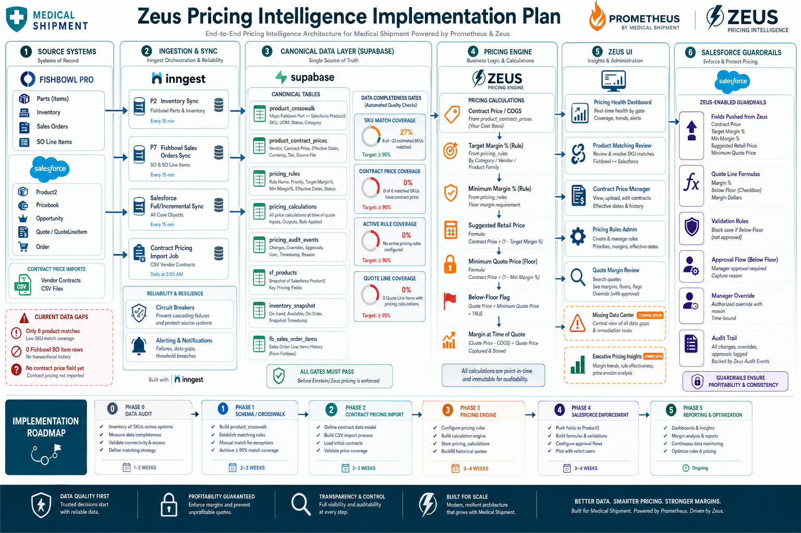

# Zeus Pricing Intelligence Implementation Plan

## Goal

Build pricing intelligence for Zeus so Medical Shipment can:

- Store contract pricing / COGS for resold products.
- Calculate suggested retail and minimum quote prices.
- Show sales reps reliable quoting guardrails.
- Enforce below-floor pricing rules in Salesforce.
- Report margin, pricing coverage, and data completeness.

For the detailed roadmap to move Purchasing Manager-maintained Contract Pricing spreadsheets into Zeus as the canonical source, see `docs/contract-pricing-canonical-source-build-plan.md`.

For the current post-hiatus sprint plan and data-quality operating checks, see:

- [Zeus Next Start Plan](./zeus-next-start-plan.md)
- [Data Completeness SOP](./data-completeness-sop.md)

Current data gaps from the live database:

- `sf_products`: 765 rows, 765 with product codes.
- `inventory_snapshot`: 4,811 Fishbowl inventory rows.
- Product code match between Fishbowl and Salesforce: 6 rows.
- `sf_opportunity_line_items`: 285 rows, all with sell prices, only 19 with cached product codes.
- `fb_sales_orders` / `fb_sales_order_items`: 0 rows at time of audit.
- No live contract price / COGS field is currently synced.

The first milestone is therefore not enforcement. It is product identity, cost coverage, and pricing-data completeness.

## Diagram



## Workstream Ownership For Codex Subagents

Use subagents in parallel after creating a branch.

### Agent A: Data Architecture

Owned files:

- `supabase/migrations/005_zeus_pricing_architecture.sql`
- `src/lib/pricing/**`
- `src/app/api/pricing/**`

Responsibilities:

- Add pricing schema.
- Add product crosswalk logic.
- Add pricing quality gates.
- Add server-side pricing calculators.

### Agent B: Salesforce Sync And Enforcement

Owned files:

- `src/lib/salesforce/**`
- `src/inngest/functions/**`
- `src/app/api/sync/**`
- `docs/salesforce-pricing-fields.md`

Responsibilities:

- Extend Salesforce Product2 sync fields after Salesforce fields exist.
- Add Zeus pushback to Product2 pricing fields.
- Add quote/order guardrail validation before Fishbowl/Salesforce mirror operations.
- Produce Salesforce admin instructions for fields, formulas, validation rules, and approval flow.

### Agent C: Zeus Pricing UI

Owned files:

- `src/app/dashboard/pricing/**`
- `src/components/pricing/**`
- `src/components/layout/Sidebar.tsx`

Responsibilities:

- Build Pricing dashboard.
- Build contract price import/review UI.
- Build product matching review.
- Build margin calculator.
- Build quote guardrail review pages.

### Agent D: QA And Data Completeness

Owned files:

- `scripts/**`
- tests when test framework is ready
- `docs/pricing-data-readiness.md`

Responsibilities:

- Add data readiness diagnostics.
- Add acceptance queries.
- Add regression checks for pricing math.
- Add rollout checklist.

## Phase 0: Data Readiness Audit

Objective: determine whether pricing enforcement can be trusted.

Tasks:

1. Query coverage metrics:
   - Salesforce products with `ProductCode`.
   - Fishbowl inventory rows with `part_number`.
   - Fishbowl/Salesforce direct SKU matches.
   - Opportunity/Fishbowl quote line item coverage.
   - Products with known COGS/contract price.
2. Create `docs/pricing-data-readiness.md`.
3. Add a diagnostic script or API endpoint for repeatable checks.
4. Define launch thresholds:
   - Product crosswalk coverage target.
   - Contract pricing coverage target.
   - COGS coverage target.
   - Quote/order line item coverage target.

Acceptance criteria:

- Zeus can produce a repeatable readiness report.
- Every readiness metric has an owner and pass/fail threshold.
- Enforcement remains disabled until thresholds are met.

## Phase 1: Pricing Schema And Product Crosswalk

Objective: create the canonical pricing identity layer.

Create migration `005_zeus_pricing_architecture.sql` with:

- `pricing_products`
- `product_crosswalk`
- `customer_contracts`
- `contract_price_lines`
- `product_cogs`
- `pricing_rules`
- `pricing_quality_results`
- `pricing_calculation_snapshots`
- `pricing_guardrail_events`
- `pricing_import_batches`

Important rules:

- Contract lines must resolve through `pricing_products`.
- Raw Salesforce and Fishbowl identifiers are not enough.
- Historical COGS rows should be preserved.
- Quality gates write results to `pricing_quality_results`.

Crosswalk matching precedence:

1. Explicit/manual mapping.
2. Salesforce `Product2.Id`.
3. Exact normalized `Product2.ProductCode` to Fishbowl `part_number`.
4. Zeus product ID / external SKU once available.
5. `needs_review`.

Acceptance criteria:

- Fresh DB migration succeeds.
- RLS allows authenticated read and service/admin writes.
- Unmatched products are visible with `match_status = 'needs_review'`.
- Existing syncs still build and run.

## Phase 2: Contract Pricing And COGS Import

Objective: get reliable cost basis into Zeus.

Tasks:

1. Define import template:
   - Contract number.
   - Customer/account key.
   - SKU / part number.
   - Contract price.
   - Cost / buy price if available.
   - UOM.
   - Effective start/end.
   - Quantity tier.
   - Vendor/source.
2. Build import pipeline:
   - Upload.
   - Parse.
   - Validate.
   - Preview.
   - Commit.
3. Store rejected rows with reasons.
4. Support manual admin edits with audit fields.
5. Decide COGS precedence:
   - Contract-specific cost.
   - Vendor last purchase cost.
   - Fishbowl standard/average cost if available.
   - Manual cost record.

Acceptance criteria:

- Valid contract price files import atomically.
- Invalid rows are rejected before commit.
- Imported prices are traceable to source batch/file.
- Current COGS can be resolved for a product and effective date.

## Phase 3: Pricing Engine

Objective: centralize pricing math.

Core formulas:

```text
suggested_retail_price = contract_price / (1 - target_margin_pct)
minimum_quote_price = contract_price / (1 - minimum_margin_pct)
gross_margin_dollars = quoted_unit_price - contract_price
gross_margin_pct = gross_margin_dollars / quoted_unit_price
below_floor = quoted_unit_price < minimum_quote_price
```

Tasks:

1. Add pricing service functions:
   - Resolve product.
   - Resolve customer/account contract.
   - Resolve active contract line.
   - Resolve current COGS.
   - Apply pricing rule.
   - Evaluate guardrails.
2. Add read models:
   - Current price by account + product.
   - Current COGS by product.
   - Margin by quote/order line.
3. Add quality gates:
   - Missing crosswalk.
   - Missing COGS.
   - Missing contract price.
   - Expired contract.
   - Overlapping price lines.
   - Currency mismatch.

Acceptance criteria:

- Pricing calculations are deterministic and unit-testable.
- Every calculation exposes source fields and rule version.
- Missing data returns an explicit guardrail result, not a silent zero.

## Phase 4: Salesforce Fields And Enforcement

Objective: make pricing guardrails visible and enforceable where reps quote.

Salesforce Product2 fields:

- `Contract_Price__c` Currency
- `Cost_Basis__c` Currency, restricted visibility
- `Target_Margin_Pct__c` Percent
- `Minimum_Margin_Pct__c` Percent
- `Suggested_Retail_Price__c` Currency
- `Minimum_Quote_Price__c` Currency
- `Pricing_Last_Verified__c` DateTime
- `Pricing_Source__c` Text/Picklist
- `Pricing_Approval_Required__c` Checkbox

Line-level fields on `OpportunityLineItem` and `QuoteLineItem`:

- `Cost_Basis_At_Quote__c` Currency
- `Floor_Price_At_Quote__c` Currency
- `Suggested_Retail_At_Quote__c` Currency
- `Gross_Margin_Pct__c` Formula Percent
- `Below_Floor__c` Formula Checkbox
- `Pricing_Exception_Reason__c` Picklist/Text
- `Pricing_Approval_Status__c` Picklist

Salesforce rules:

- Block save when unit price is below floor and approval is not approved.
- Require exception reason when discount/margin breach exists.
- Block zero/negative unit prices except explicitly allowed product categories.
- Require Pricebook2 on Opportunity/Quote.
- Require active PricebookEntry for each quoted product.

Acceptance criteria:

- A rep cannot save a below-floor quote line without approval.
- Approved exceptions retain approval metadata.
- Zeus refuses Fishbowl/Salesforce mirror operations when pricing status is invalid.

## Phase 5: Zeus Pricing UI

Objective: give operators a complete pricing workspace.

Routes:

- `/dashboard/pricing`
- `/dashboard/pricing/products`
- `/dashboard/pricing/products/[id]`
- `/dashboard/pricing/contracts`
- `/dashboard/pricing/contracts/[id]`
- `/dashboard/pricing/imports`
- `/dashboard/pricing/margins`
- `/dashboard/pricing/guardrails`

UI modules:

- Pricing health dashboard.
- Product matching review.
- Contract price manager.
- Import preview/commit workflow.
- Margin calculator.
- Quote/order guardrail review.
- Missing data drilldowns.

Role matrix:

- `admin`: all pricing/admin actions.
- `pricing_manager`: import, edit, approve overrides.
- `operator`: calculate margins, request overrides, view pricing.
- `viewer`: read-only.

Acceptance criteria:

- Unsupported modules show Coming Soon or Missing Data flags.
- Mutation APIs enforce roles server-side.
- Pricing users can identify and fix data coverage gaps without reading raw tables.

## Phase 6: Rollout

Rollout modes:

1. Read-only data audit.
2. Contract import pilot.
3. Margin calculator.
4. Warn-only guardrails.
5. Salesforce enforcement.
6. Automated Product2 pushback.

Do not enable hard enforcement until:

- Product crosswalk coverage is acceptable.
- Contract price coverage is acceptable.
- COGS coverage is acceptable.
- P7 Fishbowl SO sync is populating line items.
- Medical Shipment signs off on margin thresholds.

## Immediate Next Codex Sprint

1. Create branch `codex/pricing-foundation`.
2. Agent A implements migration and pricing service skeleton.
3. Agent D implements readiness diagnostic script/API.
4. Agent C adds read-only `/dashboard/pricing` with current gaps and Coming Soon flags.
5. Agent B writes Salesforce admin field guide, no sync pushback until fields exist.
6. Run lint/build.
7. Apply Supabase migration after review.
8. Commit and push.

## Open Decisions

- What system is the source of contract pricing: vendor file, Fishbowl, Salesforce, or manual Zeus import?
- Which cost should drive margin: standard cost, average cost, last purchase cost, landed cost, or contract buy price?
- Should missing COGS block quoting or warn initially?
- Are reps quoting in Salesforce Opportunities, Salesforce Quotes, Fishbowl Sales Orders, or a mix?
- What minimum margin and target margin should Medical Shipment use by product family?
